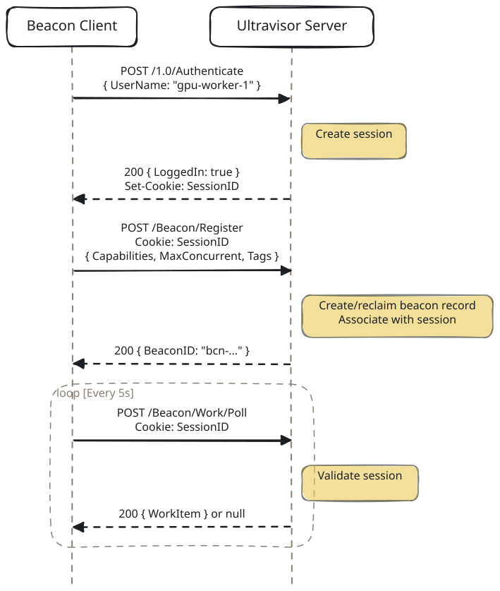

# Beacon Authentication

## Overview

Ultravisor uses Orator Authentication to manage beacon identity and connectivity. Beacons authenticate with the server before registering, receive a session cookie, and use it on all subsequent requests. If a session expires or the server restarts, beacons automatically re-authenticate and re-register -- eliminating "unknown beacon" errors and providing graceful reconnection.

## Architecture

### Session-Based Identity

Rather than a custom identity scheme, beacons use Orator's cookie-based session system:

<!-- bespoke diagram: edit diagrams/session-based-identity.mmd or .hints.json, then: npx pict-renderer-graph build modules/apps/ultravisor/docs/features -->


### Separation of Concerns

- **Orator Authentication** handles identity: sessions, cookies, credential verification
- **Beacon Coordinator** handles capabilities: registration, work dispatch, affinity, timeouts
- A beacon record stores both its `BeaconID` (coordinator identity) and `SessionID` (auth identity)

## Reconnection Protocol

When a session becomes invalid (server restart, session expiry, network interruption), the beacon detects a 401 response and automatically reconnects:

```
1. Any HTTP request returns 401
2. Client sets _Authenticating flag (prevents concurrent reconnects)
3. Clear poll and heartbeat intervals
4. Clear stale session cookie
5. POST /1.0/Authenticate (get fresh session)
6. POST /Beacon/Register (coordinator reclaims offline beacon or creates new)
7. Restart poll and heartbeat intervals
8. On failure: retry in 10 seconds
```

### Beacon Reclamation

When a beacon re-registers with the same `Name` after reconnection, the coordinator checks for an existing beacon record with `Status: 'Offline'`. If found, it **reclaims** the existing record:

- Same `BeaconID` is preserved
- Affinity bindings remain intact
- SessionID is updated to the new session
- Status is set back to `Online`

This avoids duplicate beacon entries and preserves work routing continuity.

## Configuration

### Server-Side

In Ultravisor settings:

```json
{
  "UltravisorBeaconSessionTTLMs": 86400000
}
```

| Setting | Default | Description |
|---------|---------|-------------|
| `UltravisorBeaconSessionTTLMs` | `86400000` (24h) | Session time-to-live in milliseconds |

The default authenticator accepts any username with any (or empty) password. This allows beacons to connect without credential management. To require credentials, set a custom authenticator on the OratorAuthentication service.

### Client-Side

In `.ultravisor-beacon.json`:

```json
{
  "Name": "gpu-worker-1",
  "Password": "",
  "ServerURL": "http://localhost:54321",
  "Capabilities": ["Shell", "FileSystem"],
  "MaxConcurrent": 4,
  "PollIntervalMs": 5000,
  "HeartbeatIntervalMs": 30000
}
```

CLI options:

```
node Ultravisor-Beacon-CLI.cjs --password <password>
```

| Option | Config Key | Default | Description |
|--------|-----------|---------|-------------|
| `--password` | `Password` | `""` | Password for authentication |
| `--name` | `Name` | `"beacon-worker"` | Beacon name (used as username) |
| `--server` | `ServerURL` | `"http://localhost:54321"` | Server URL |

## Non-Promiscuous Admission

Sessions establish who a beacon is. Admission decides whether it may join at all. By default every beacon is admitted. With `UltravisorNonPromiscuous` set to `true`, every WebSocket `BeaconRegister` must carry a `JoinSecret`:

- A beacon advertising the `Authentication` capability, when no auth beacon is registered, must present `UltravisorBootstrapAuthSecret`. The hub cannot ask the auth beacon to vet itself, so it checks this secret locally.
- Every other beacon is vetted by the auth beacon through `AUTH_ValidateBeaconJoin`. With no auth beacon registered, the join is refused.

HTTP `/Beacon/Register` does not run this check unless `UltravisorHTTPBeaconAdmission` is set (see [HTTP registration](#http-registration) below).

### When the auth beacon's connection drops

When the auth beacon's WebSocket drops, the hub keeps its record (Status `Offline`) so the beacon can reclaim it on reconnect. The hub also keeps treating that record as the auth beacon. So the auth beacon's own reconnect is sent to itself to validate. Nothing answers, the dispatch times out, and the reconnect is refused. The beacon keeps retrying and keeps being refused, and logins and beacon joins fail the same way, until the hub restarts.

`UltravisorAuthBeaconRejoinViaBootstrap` lets that reconnect present the bootstrap secret again. Only the value `true` turns it on, and it applies only when all of the following hold:

1. The joining beacon advertises `Authentication` and uses the `Name` of a registered record that also advertises `Authentication`.
2. The hub holds no socket for that record. A socket that is still closing counts as held.
3. The record was dropped over WebSocket and has not been reclaimed or heartbeated since. An auth beacon on HTTP transport never qualifies.
4. No other auth beacon has an open socket. While one does, it validates the join as before.

In every other case the join goes through `AUTH_ValidateBeaconJoin`, exactly as it does without the key. Two things follow from the rules:

- The auth beacon must reconnect under the name it first registered with. The auth beacon CLI uses `auth-beacon` unless given `--name`.
- An HTTP heartbeat carries whatever `BeaconID` the caller sends. A heartbeat for the dropped record's `BeaconID` makes it fail rule 3, and its reconnect is then refused as it would be without the key.

The key is left out of the hub's default configuration on purpose, so state persistence never writes it into an operator's `.ultravisor.json`. Set it there yourself:

```json
{
  "UltravisorNonPromiscuous": true,
  "UltravisorBootstrapAuthSecret": "a-long-random-secret",
  "UltravisorAuthBeaconRejoinViaBootstrap": true
}
```

Anyone holding the bootstrap secret can already register as the auth beacon when the hub starts. With this key on, they can also do it whenever the auth beacon's connection is down. Guard the secret with that in mind.

### Keeping credentials off disk

Every call the hub makes to the auth beacon is a work item with Capability `Authentication`: join checks, logins, user management and bootstrap admin. By default these are persisted like any other work item. Their `Settings` carry the credential being checked (`JoinSecret`, `Password`, the bootstrap admin `Token`), and their `Result` can carry a `SessionToken`. Both are written to the queue journal (`queue-journal.jsonl`), the compaction snapshot (`queue-snapshot.json`), and the queue store or persistence beacon. Nothing prunes them.

Set `UltravisorEphemeralAuthDispatches` to `true` to keep those items in memory. Only the value `true` turns it on. It applies to Authentication items with no `RunHash`, which is every call the hub makes to the auth beacon. An Authentication step inside an operation graph is still persisted, because the graph needs the journal to resume after a restart. The auth beacon receives the same work item either way.

With it on:

- The `Settings` and `Result` of those items no longer reach disk.
- Their metadata still does: journal lines for claim, complete, fail, retry and stall, the `auth` affinity binding, and timeline rows (hash, capability, action, beacon).
- They no longer appear in `GET /Beacon/Queue?include=history`, and `GET /Beacon/Work/:hash/Events` returns nothing for them. Action defaults collect no timing samples for Authentication.
- While an item is in flight, `GET /Beacon/Work` and `GET /Beacon/Queue` still show its `Settings` to any session holder.
- Items restored from a journal written before the option was set are persisted as they were.
- Nothing already on disk is removed. To clear it, purge the Authentication rows and the journal, and rotate the secrets they held.

Like the rejoin key, it is left out of the default configuration. Set it in your `.ultravisor.json` or pass it with `--config`.

### Frame identity

A beacon's WebSocket `BeaconHeartbeat` and `Deregister` frames each carry a `BeaconID`, and by default the hub acts on whichever beacon the frame names. Any connected socket can therefore keep another beacon's record alive, or deregister it. `UltravisorBeaconWSFrameIdentity` changes that:

| Value | Effect |
|-------|--------|
| not set | Act on the `BeaconID` in the frame, as before. |
| `"warn"` | The same, plus a warning (once per socket and frame type) when the frame names a beacon other than the one the socket registered. Use it to measure before enforcing. |
| `true` or `"socket"` | Act only on the beacon this socket registered, and only while this socket still holds that registration. The frame's `BeaconID` is ignored. A frame on a socket with no current registration is dropped. |

Any other value is treated as not set. The work frames (`WorkComplete`, `WorkError`, `WorkProgress`) are not affected.

In socket mode the hub also closes one race. When admission finishes after the beacon's socket has closed, or after the beacon sent `Deregister` on it, the socket is not bound. A beacon that asked to stop is deregistered and its work released, unless another live socket already holds its record. Otherwise the record stays as the drop left it.

Socket mode is only as strong as admission. On a promiscuous hub any socket can register under another beacon's `Name` and take over its record, so the setting protects nothing there. On a secured hub it relies on the auth beacon tying each join credential to one beacon `Name`.

It is left out of the default configuration, like the keys above.

### HTTP registration

A beacon on HTTP transport registers with `POST /Beacon/Register`. That route requires a session, but by default it does not run admission, so on a secured hub any session holder can register a beacon without a `JoinSecret`. `UltravisorHTTPBeaconAdmission` makes it run the same admission as the WebSocket path:

| Value | Effect |
|-------|--------|
| not set, `false` or `"off"` | No admission check, as before. |
| `"audit"` | Register as before, and log each register that `"enforce"` would refuse, once per beacon name until it passes. Use it to find the beacons enforcing would lock out. |
| `"enforce"` or `true` | The register must pass admission. |

Strings are matched ignoring case and surrounding spaces. Any other value means off, and the hub logs a warning saying so; the string `"true"` is one of those. When the key is set, the hub logs the mode it took once at startup. It also warns when `UltravisorNonPromiscuous` is not set, because then admission admits every beacon and the key has no effect.

Under `"enforce"`, a refused register gets a 403 whose `Reason` says why. When the auth beacon is down or slow, the check times out after up to five seconds and that also comes back as a 403, with the timeout as the `Reason`. A 503 means the admission check itself failed. Admission never answers 401, because the beacon client reads 401 as an expired session and would log in and retry in a loop. A request with no session still gets the usual 401 before admission runs.

Before relying on it:

- Do not turn on `UltravisorNonPromiscuous` on an existing hub just to try `"audit"`. That flag alone refuses every WebSocket beacon that has no `JoinSecret`.
- To back out, stop the hub before editing `.ultravisor.json`. State persistence writes back the configuration the hub started with.
- It covers registration only. `POST /Beacon/Work/Poll` and `POST /Beacon/:BeaconID/Heartbeat` still act on whatever `BeaconID` the caller sends, for any valid session, so it is not a complete boundary on its own.

It is left out of the default configuration, like the keys above.

### Auth dispatch hardening

Two more keys close holes around the hub's calls to the auth beacon. Each is off unless set to `true` or the string `"true"`, in either `.ultravisor.json` or the hub's settings; a `false` in one does not override a `true` in the other.

`UltravisorAuthDispatchPinned`. The hub sends every call to the auth beacon with the affinity key `auth`, and the coordinator matches an affinity key against beacon names before it checks capabilities. A beacon that registers under the name `auth` therefore receives every login, password and join secret. With this key on, the hub sends each call to the live auth beacon by its own name, and only that beacon may take it. When no auth beacon is live, the call goes out as before. Two limits:

- If the pinned beacon is explicitly deregistered while a call is waiting, the scheduler can still hand that call to any other beacon advertising `Authentication`.
- A beacon that registers under the auth beacon's own name takes over its record, pin and all. On a secured hub, admission is what prevents that.

A hub whose logins do not go through the auth beacon, such as an embedder that installs its own authenticator, gains little from it.

`UltravisorRefuseAuthenticationDispatch`. The HTTP dispatch routes (`POST /Beacon/Work/Dispatch`, `/Beacon/Work/DispatchStream` and `/Beacon/Work/Enqueue`) accept any capability from any session holder, `Authentication` included. That lets a session holder use the auth beacon to test passwords, tokens and join secrets, or call the user-management actions without the admin check that `/1.0/Users` applies. With this key on, those routes answer 403 for `Authentication`. The hub's own calls to the auth beacon do not use these routes and are not affected.

Neither key is in the default configuration. Older hubs ignore both without complaint, so confirm the hub's version before relying on them.

### Work-frame identity

A beacon reports a work item's result over its WebSocket with a `WorkComplete`, `WorkError`, `WorkProgress`, `WorkCancelAck`, `WorkCanceled` or `WorkResultUpload` frame. The hub acts on whichever `WorkItemHash` the frame names. The upgrade is never gated, and a completion is refused only when its reported beacon id disagrees with the assignment, so a frame from a socket that never registered (it carries no beacon id) is accepted. A socket that can reach the hub can therefore forge the result of a work item it was never given, including the result of an `AUTH_Login` or `AUTH_ValidateBeaconJoin` the hub dispatched to the auth beacon, which forges a login or a join.

`UltravisorBeaconWSWorkFrameIdentity` ties those frames to the socket:

| Value | Effect |
|-------|--------|
| not set | Act on the frame whatever socket it came from, as before. |
| `"warn"` | The same, plus a warning (once per socket and frame type) when the socket is not the item's assigned beacon. Use it to measure before enforcing. |
| `true` or `"socket"` | Act only when the socket holds the item's assigned registration: `_BeaconWebSockets[BeaconID]` is this socket, and the item's `AssignedBeaconID` is that beacon. A frame from any other socket, or for an item with no assigned beacon, is dropped. |

Any other value is treated as not set. This is the one change that closes the forge, so set it to `"socket"` before the hub is reachable from anywhere untrusted.

### Redacting Authentication settings

`GET /Beacon/Work` and `GET /Beacon/Queue` return live work items, Settings included, to any hub session. For an Authentication item those Settings hold the credential the hub is checking, and its Result can hold a session token. `UltravisorRedactAuthDispatchSettings` set to `true` (or `"true"`) blanks the Settings and Result of Authentication items in those two responses, History included, without touching the stored item. It pairs with `UltravisorEphemeralAuthDispatches`, which keeps the same fields off disk: one closes the read routes, the other the journal and snapshot.

Neither key is in the default configuration.

## Security Model

### Graduated Security

The system is designed for incremental security hardening:

**Level 0 -- Open (default):**
No credentials required. Any beacon name is accepted. Suitable for development and trusted networks.

**Level 1 -- Shared secret:**
Set a custom authenticator that checks passwords against a configured secret or API key list:

```javascript
tmpAuth.setAuthenticator((pUsername, pPassword, fCallback) =>
{
    if (pPassword === process.env.BEACON_SECRET)
    {
        return fCallback(null, { LoginID: pUsername, IDUser: 0 });
    }
    return fCallback(null, null);
});
```

**Level 2 -- Per-beacon credentials:**
Validate each beacon's name and password against a database or config:

```javascript
tmpAuth.setAuthenticator((pUsername, pPassword, fCallback) =>
{
    let tmpBeaconCreds = loadBeaconCredentials();
    let tmpRecord = tmpBeaconCreds[pUsername];
    if (tmpRecord && tmpRecord.Password === pPassword)
    {
        return fCallback(null, { LoginID: pUsername, IDUser: tmpRecord.ID });
    }
    return fCallback(null, null);
});
```

**Level 3 -- OAuth/OIDC:**
For beacons on remote networks, use Orator Authentication's built-in OIDC provider to authenticate against an identity provider (Azure AD, Okta, etc.).

## HTTP Endpoints

### Authentication (provided by Orator Authentication)

| Method | Path | Auth Required | Description |
|--------|------|--------------|-------------|
| POST | `/1.0/Authenticate` | No | Authenticate with username/password, receive session cookie |
| GET | `/1.0/CheckSession` | Cookie | Validate current session |
| GET | `/1.0/Deauthenticate` | Cookie | End session |

### Beacon (all require valid session cookie)

| Method | Path | Description |
|--------|------|-------------|
| POST | `/Beacon/Register` | Register beacon, associate with session |
| GET | `/Beacon` | List all beacons |
| GET | `/Beacon/:BeaconID` | Get specific beacon |
| DELETE | `/Beacon/:BeaconID` | Deregister beacon |
| POST | `/Beacon/:BeaconID/Heartbeat` | Send heartbeat |
| POST | `/Beacon/Work/Poll` | Poll for work items |
| POST | `/Beacon/Work/:WorkItemHash/Complete` | Report work completion |
| POST | `/Beacon/Work/:WorkItemHash/Error` | Report work failure |
| POST | `/Beacon/Work/:WorkItemHash/Progress` | Report progress |
| POST | `/Beacon/Work/Dispatch` | Direct synchronous dispatch |
| GET | `/Beacon/Work` | List all work items |
| GET | `/Beacon/Affinity` | List affinity bindings |
| GET | `/Beacon/Capabilities` | List available capabilities |

## Implementation Details

### Files

| File | Role |
|------|------|
| `source/web_server/Ultravisor-API-Server.cjs` | Initializes OratorAuthentication, guards beacon endpoints with session validation |
| `source/services/Ultravisor-Beacon-Coordinator.cjs` | Stores SessionID on beacon records, supports reconnection via name-based lookup |
| `source/beacon/Ultravisor-Beacon-Client.cjs` | Authenticates before registering, sends cookies, detects 401, reconnects automatically |
| `source/beacon/Ultravisor-Beacon-CLI.cjs` | Accepts `--password` CLI option |

### Session Lifecycle

1. **Creation:** Beacon POSTs to `/1.0/Authenticate` -> session created in-memory Map -> `Set-Cookie` header returned
2. **Validation:** Every beacon request -> `getSessionForRequest()` parses cookie, looks up session, checks TTL, updates `LastAccess`
3. **Expiry:** Session TTL exceeded (default 24h) -> next request returns 401 -> beacon reconnects
4. **Server restart:** All sessions lost (in-memory) -> all beacons get 401 -> all reconnect automatically

### Timeout Interactions

- **Poll interval (5s):** Each poll validates the session, keeping `LastAccess` current. Sessions stay alive as long as the beacon is polling.
- **Heartbeat interval (30s):** Also validates session. Redundant with poll but provides a safety net.
- **Beacon heartbeat timeout (60s):** Coordinator marks beacon `Offline` if no poll or heartbeat received. Happens independently of session expiry.
- **Session TTL (24h):** Much longer than heartbeat timeout. A beacon goes `Offline` long before its session expires.
- **Work item timeout (5m default):** If a beacon disconnects mid-work, the coordinator times out the work item independently.
