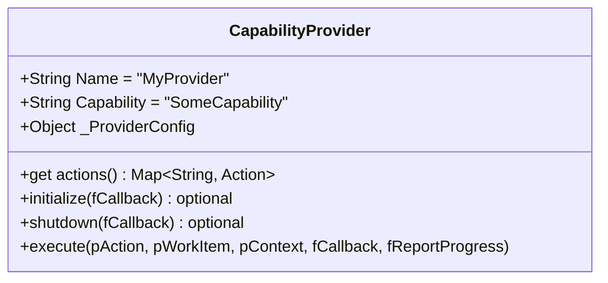

# Building Beacon Providers

This guide walks through building custom Beacon providers from scratch,
with two full examples: a headless Chrome browser automation provider and
an FFmpeg video transcoding provider. By the end, you will know how to
create a provider, configure it, wire it into a Beacon, and dispatch work
to it from an operation manifest.

For reference-level documentation on the provider interface, built-in
providers, and progress reporting, see [Beacons](beacons.md).

## Quick-Start: Running a Beacon

Before writing custom providers, let's make sure you can run a basic Beacon
against an Ultravisor server.

### 1. Start the Ultravisor Server

```bash
node source/Ultravisor-Server.cjs --config ./my-config.json
```

### 2. Start a Shell-Only Beacon

The simplest Beacon uses only the built-in Shell provider:

```bash
node source/beacon/Ultravisor-Beacon-CLI.cjs \
  --server http://localhost:54321 \
  --name "shell-worker" \
  --capabilities Shell
```

### 3. Dispatch Work to It

Create a manifest with a `beacon-dispatch` node:

```json
{
    "Scope": "Operation",
    "Nodes":
    {
        "start": { "Type": "start" },
        "run-command":
        {
            "Type": "beacon-dispatch",
            "Settings":
            {
                "Capability": "Shell",
                "Action": "Execute",
                "Command": "echo",
                "Parameters": "hello from the Beacon"
            }
        },
        "end": { "Type": "end" }
    },
    "Edges":
    {
        "start": [{ "Target": "run-command", "Event": "Complete" }],
        "run-command": [{ "Target": "end", "Event": "Complete" }]
    }
}
```

Start an operation from this manifest, and the Beacon picks it up, runs
`echo hello from the Beacon`, and reports back the output. The graph
resumes and completes.

### 4. Use a Config File

For anything beyond quick tests, use a `.ultravisor-beacon.json` file:

```json
{
    "ServerURL": "http://localhost:54321",
    "Name": "dev-worker",
    "Capabilities": ["Shell", "FileSystem"],
    "MaxConcurrent": 2,
    "PollIntervalMs": 3000,
    "StagingPath": "/tmp/beacon-staging"
}
```

Then start the Beacon with no arguments (it reads from the config file):

```bash
cd /path/to/config && node /path/to/Ultravisor-Beacon-CLI.cjs
```

---

## Anatomy of a Provider

Every provider is a plain JavaScript class that extends
`UltravisorBeaconCapabilityProvider`. There is no Fable dependency -- keep
providers lightweight and self-contained.



### The `execute` Contract

```js
execute(pAction, pWorkItem, pContext, fCallback, fReportProgress)
```

| Parameter | Description |
|-----------|-------------|
| `pAction` | The action string (e.g. `'Transcode'`, `'Screenshot'`) |
| `pWorkItem` | Work item record. Use `pWorkItem.Settings` for task-specific parameters |
| `pContext` | Execution context: `{ StagingPath, NodeHash, ... }` |
| `fCallback(pError, pResult)` | Completion callback. `pResult` must include `{ Outputs: { StdOut, ExitCode, Result }, Log: [] }` |
| `fReportProgress(pData)` | Optional progress callback: `{ Percent, Message, Step, TotalSteps, Log }` |

The `fCallback` result shape:

```js
fCallback(null, {
    Outputs: {
        StdOut: 'Human-readable summary of what happened',
        ExitCode: 0,       // 0 = success, non-zero = failure
        Result: '...'      // Structured output data (string or JSON string)
    },
    Log: [
        'Step 1: did X',
        'Step 2: did Y'
    ]
});
```

---

## Example 1: Headless Chrome Provider

This provider launches a headless Chrome browser to take screenshots,
generate PDFs, or scrape content from web pages. It uses Puppeteer under
the hood.

### Provider Implementation

```js
// headless-chrome-provider.cjs

const libBeaconCapabilityProvider = require('ultravisor').BeaconCapabilityProvider;

let libPuppeteer;
try { libPuppeteer = require('puppeteer'); }
catch (pErr) { libPuppeteer = null; }

class HeadlessChromeProvider extends libBeaconCapabilityProvider
{
	constructor(pProviderConfig)
	{
		super(pProviderConfig);

		this.Name = 'HeadlessChrome';
		this.Capability = 'Browser';

		// Provider config with sensible defaults
		this._NavigationTimeoutMs = this._ProviderConfig.NavigationTimeoutMs || 30000;
		this._DefaultViewport = this._ProviderConfig.Viewport || { width: 1280, height: 800 };
		this._AllowedDomains = this._ProviderConfig.AllowedDomains || [];

		this._Browser = null;
	}

	get actions()
	{
		return {
			'Screenshot':
			{
				Description: 'Navigate to a URL and capture a screenshot as a PNG file.',
				SettingsSchema:
				[
					{ Name: 'URL', DataType: 'String', Required: true, Description: 'The page URL to screenshot' },
					{ Name: 'OutputFile', DataType: 'String', Required: false, Description: 'Output filename (default: screenshot.png)' },
					{ Name: 'FullPage', DataType: 'Boolean', Required: false, Description: 'Capture the full scrollable page (default: false)' },
					{ Name: 'WaitForSelector', DataType: 'String', Required: false, Description: 'CSS selector to wait for before capture' }
				]
			},
			'PDF':
			{
				Description: 'Navigate to a URL and render the page as a PDF document.',
				SettingsSchema:
				[
					{ Name: 'URL', DataType: 'String', Required: true, Description: 'The page URL to render' },
					{ Name: 'OutputFile', DataType: 'String', Required: false, Description: 'Output filename (default: page.pdf)' },
					{ Name: 'Format', DataType: 'String', Required: false, Description: 'Page format: Letter, A4, etc. (default: Letter)' }
				]
			},
			'Scrape':
			{
				Description: 'Navigate to a URL and extract text content or element data.',
				SettingsSchema:
				[
					{ Name: 'URL', DataType: 'String', Required: true, Description: 'The page URL to scrape' },
					{ Name: 'Selector', DataType: 'String', Required: false, Description: 'CSS selector to extract (default: body)' },
					{ Name: 'ExtractAttribute', DataType: 'String', Required: false, Description: 'Element attribute to extract instead of text (e.g. href, src)' }
				]
			}
		};
	}

	// -------------------------------------------------------------------
	// Lifecycle
	// -------------------------------------------------------------------

	initialize(fCallback)
	{
		if (!libPuppeteer)
		{
			return fCallback(new Error('Puppeteer is not installed. Run: npm install puppeteer'));
		}

		let tmpThis = this;

		libPuppeteer.launch({
			headless: 'new',
			args: ['--no-sandbox', '--disable-setuid-sandbox']
		})
		.then(function (pBrowser)
		{
			tmpThis._Browser = pBrowser;
			return fCallback(null);
		})
		.catch(function (pError)
		{
			return fCallback(new Error('Failed to launch Chrome: ' + pError.message));
		});
	}

	shutdown(fCallback)
	{
		if (this._Browser)
		{
			this._Browser.close()
				.then(function () { return fCallback(null); })
				.catch(function () { return fCallback(null); });
		}
		else
		{
			return fCallback(null);
		}
	}

	// -------------------------------------------------------------------
	// Action dispatcher
	// -------------------------------------------------------------------

	execute(pAction, pWorkItem, pContext, fCallback, fReportProgress)
	{
		switch (pAction)
		{
			case 'Screenshot':
				return this._executeScreenshot(pWorkItem, pContext, fCallback, fReportProgress);
			case 'PDF':
				return this._executePDF(pWorkItem, pContext, fCallback, fReportProgress);
			case 'Scrape':
				return this._executeScrape(pWorkItem, pContext, fCallback, fReportProgress);
			default:
				return fCallback(null, {
					Outputs: { StdOut: 'Unknown action: ' + pAction, ExitCode: -1, Result: '' },
					Log: ['HeadlessChrome: unsupported action [' + pAction + '].']
				});
		}
	}

	// -------------------------------------------------------------------
	// Domain guard
	// -------------------------------------------------------------------

	_isDomainAllowed(pURL)
	{
		if (this._AllowedDomains.length === 0) return true;
		try
		{
			let tmpHostname = new URL(pURL).hostname;
			for (let i = 0; i < this._AllowedDomains.length; i++)
			{
				if (tmpHostname === this._AllowedDomains[i]) return true;
				if (tmpHostname.endsWith('.' + this._AllowedDomains[i])) return true;
			}
			return false;
		}
		catch (pErr)
		{
			return false;
		}
	}

	// -------------------------------------------------------------------
	// Actions
	// -------------------------------------------------------------------

	_executeScreenshot(pWorkItem, pContext, fCallback, fReportProgress)
	{
		let tmpSettings = pWorkItem.Settings || {};
		let tmpURL = tmpSettings.URL;
		let tmpOutputFile = tmpSettings.OutputFile || 'screenshot.png';
		let tmpFullPage = tmpSettings.FullPage || false;
		let tmpWaitFor = tmpSettings.WaitForSelector || null;
		let tmpThis = this;

		if (!tmpURL)
		{
			return fCallback(null, {
				Outputs: { StdOut: 'No URL specified.', ExitCode: -1, Result: '' },
				Log: ['HeadlessChrome Screenshot: no URL specified.']
			});
		}

		if (!this._isDomainAllowed(tmpURL))
		{
			return fCallback(null, {
				Outputs: { StdOut: 'Domain not in AllowedDomains: ' + tmpURL, ExitCode: -1, Result: '' },
				Log: ['HeadlessChrome Screenshot: domain blocked by AllowedDomains.']
			});
		}

		// Resolve output path relative to staging
		let libPath = require('path');
		let tmpOutputPath = libPath.isAbsolute(tmpOutputFile)
			? tmpOutputFile
			: libPath.resolve(pContext.StagingPath || process.cwd(), tmpOutputFile);

		let tmpPage;
		let tmpLog = [];

		this._Browser.newPage()
			.then(function (pPage)
			{
				tmpPage = pPage;
				tmpLog.push('Opened new browser tab.');
				fReportProgress({ Percent: 10, Message: 'Navigating to ' + tmpURL });

				return tmpPage.setViewport(tmpThis._DefaultViewport);
			})
			.then(function ()
			{
				return tmpPage.goto(tmpURL, {
					waitUntil: 'networkidle2',
					timeout: tmpThis._NavigationTimeoutMs
				});
			})
			.then(function ()
			{
				tmpLog.push('Navigation complete: ' + tmpURL);
				fReportProgress({ Percent: 50, Message: 'Page loaded' });

				if (tmpWaitFor)
				{
					tmpLog.push('Waiting for selector: ' + tmpWaitFor);
					return tmpPage.waitForSelector(tmpWaitFor, { timeout: 10000 });
				}
			})
			.then(function ()
			{
				fReportProgress({ Percent: 70, Message: 'Capturing screenshot' });

				return tmpPage.screenshot({
					path: tmpOutputPath,
					fullPage: tmpFullPage
				});
			})
			.then(function ()
			{
				tmpLog.push('Screenshot saved: ' + tmpOutputPath);
				fReportProgress({ Percent: 100, Message: 'Done' });

				return tmpPage.close();
			})
			.then(function ()
			{
				return fCallback(null, {
					Outputs: {
						StdOut: 'Screenshot saved to ' + tmpOutputPath,
						ExitCode: 0,
						Result: tmpOutputPath
					},
					Log: tmpLog
				});
			})
			.catch(function (pError)
			{
				tmpLog.push('Error: ' + pError.message);
				if (tmpPage) { tmpPage.close().catch(function () {}); }
				return fCallback(null, {
					Outputs: { StdOut: 'Screenshot failed: ' + pError.message, ExitCode: 1, Result: '' },
					Log: tmpLog
				});
			});
	}

	_executePDF(pWorkItem, pContext, fCallback, fReportProgress)
	{
		let tmpSettings = pWorkItem.Settings || {};
		let tmpURL = tmpSettings.URL;
		let tmpOutputFile = tmpSettings.OutputFile || 'page.pdf';
		let tmpFormat = tmpSettings.Format || 'Letter';
		let tmpThis = this;

		if (!tmpURL)
		{
			return fCallback(null, {
				Outputs: { StdOut: 'No URL specified.', ExitCode: -1, Result: '' },
				Log: ['HeadlessChrome PDF: no URL specified.']
			});
		}

		if (!this._isDomainAllowed(tmpURL))
		{
			return fCallback(null, {
				Outputs: { StdOut: 'Domain not in AllowedDomains: ' + tmpURL, ExitCode: -1, Result: '' },
				Log: ['HeadlessChrome PDF: domain blocked by AllowedDomains.']
			});
		}

		let libPath = require('path');
		let tmpOutputPath = libPath.isAbsolute(tmpOutputFile)
			? tmpOutputFile
			: libPath.resolve(pContext.StagingPath || process.cwd(), tmpOutputFile);

		let tmpPage;
		let tmpLog = [];

		this._Browser.newPage()
			.then(function (pPage)
			{
				tmpPage = pPage;
				fReportProgress({ Percent: 10, Message: 'Navigating to ' + tmpURL });
				return tmpPage.goto(tmpURL, {
					waitUntil: 'networkidle2',
					timeout: tmpThis._NavigationTimeoutMs
				});
			})
			.then(function ()
			{
				tmpLog.push('Navigation complete: ' + tmpURL);
				fReportProgress({ Percent: 60, Message: 'Rendering PDF' });
				return tmpPage.pdf({ path: tmpOutputPath, format: tmpFormat, printBackground: true });
			})
			.then(function ()
			{
				tmpLog.push('PDF saved: ' + tmpOutputPath);
				fReportProgress({ Percent: 100, Message: 'Done' });
				return tmpPage.close();
			})
			.then(function ()
			{
				return fCallback(null, {
					Outputs: { StdOut: 'PDF saved to ' + tmpOutputPath, ExitCode: 0, Result: tmpOutputPath },
					Log: tmpLog
				});
			})
			.catch(function (pError)
			{
				tmpLog.push('Error: ' + pError.message);
				if (tmpPage) { tmpPage.close().catch(function () {}); }
				return fCallback(null, {
					Outputs: { StdOut: 'PDF failed: ' + pError.message, ExitCode: 1, Result: '' },
					Log: tmpLog
				});
			});
	}

	_executeScrape(pWorkItem, pContext, fCallback, fReportProgress)
	{
		let tmpSettings = pWorkItem.Settings || {};
		let tmpURL = tmpSettings.URL;
		let tmpSelector = tmpSettings.Selector || 'body';
		let tmpAttribute = tmpSettings.ExtractAttribute || null;
		let tmpThis = this;

		if (!tmpURL)
		{
			return fCallback(null, {
				Outputs: { StdOut: 'No URL specified.', ExitCode: -1, Result: '' },
				Log: ['HeadlessChrome Scrape: no URL specified.']
			});
		}

		if (!this._isDomainAllowed(tmpURL))
		{
			return fCallback(null, {
				Outputs: { StdOut: 'Domain not in AllowedDomains: ' + tmpURL, ExitCode: -1, Result: '' },
				Log: ['HeadlessChrome Scrape: domain blocked by AllowedDomains.']
			});
		}

		let tmpPage;
		let tmpLog = [];

		this._Browser.newPage()
			.then(function (pPage)
			{
				tmpPage = pPage;
				fReportProgress({ Percent: 20, Message: 'Loading page' });
				return tmpPage.goto(tmpURL, {
					waitUntil: 'networkidle2',
					timeout: tmpThis._NavigationTimeoutMs
				});
			})
			.then(function ()
			{
				tmpLog.push('Loaded: ' + tmpURL);
				fReportProgress({ Percent: 60, Message: 'Extracting content' });

				if (tmpAttribute)
				{
					return tmpPage.$$eval(tmpSelector, function (pElements, pAttr)
					{
						return pElements.map(function (pEl) { return pEl.getAttribute(pAttr) || ''; });
					}, tmpAttribute);
				}
				else
				{
					return tmpPage.$$eval(tmpSelector, function (pElements)
					{
						return pElements.map(function (pEl) { return pEl.textContent.trim(); });
					});
				}
			})
			.then(function (pResults)
			{
				tmpLog.push('Extracted ' + pResults.length + ' elements matching [' + tmpSelector + '].');
				fReportProgress({ Percent: 100, Message: 'Done' });
				return tmpPage.close().then(function () { return pResults; });
			})
			.then(function (pResults)
			{
				let tmpResultStr = JSON.stringify(pResults);

				return fCallback(null, {
					Outputs: {
						StdOut: 'Scraped ' + pResults.length + ' elements.',
						ExitCode: 0,
						Result: tmpResultStr
					},
					Log: tmpLog
				});
			})
			.catch(function (pError)
			{
				tmpLog.push('Error: ' + pError.message);
				if (tmpPage) { tmpPage.close().catch(function () {}); }
				return fCallback(null, {
					Outputs: { StdOut: 'Scrape failed: ' + pError.message, ExitCode: 1, Result: '' },
					Log: tmpLog
				});
			});
	}
}

module.exports = HeadlessChromeProvider;
```

### Configuration

```json
{
    "ServerURL": "http://orchestrator:54321",
    "Name": "browser-worker-1",
    "MaxConcurrent": 2,
    "StagingPath": "/data/browser-staging",
    "Providers": [
        { "Source": "Shell" },
        { "Source": "FileSystem" },
        {
            "Source": "./headless-chrome-provider.cjs",
            "Config": {
                "NavigationTimeoutMs": 60000,
                "Viewport": { "width": 1920, "height": 1080 },
                "AllowedDomains": ["example.com", "internal.corp.net"]
            }
        }
    ]
}
```

### Dispatching Browser Work

Screenshot a page:

```json
{
    "Type": "beacon-dispatch",
    "Settings":
    {
        "Capability": "Browser",
        "Action": "Screenshot",
        "URL": "https://example.com/dashboard",
        "OutputFile": "dashboard.png",
        "FullPage": true,
        "WaitForSelector": ".dashboard-loaded"
    }
}
```

Generate a PDF report:

```json
{
    "Type": "beacon-dispatch",
    "Settings":
    {
        "Capability": "Browser",
        "Action": "PDF",
        "URL": "https://internal.corp.net/reports/monthly",
        "OutputFile": "monthly-report.pdf",
        "Format": "A4"
    }
}
```

Scrape product prices:

```json
{
    "Type": "beacon-dispatch",
    "Settings":
    {
        "Capability": "Browser",
        "Action": "Scrape",
        "URL": "https://example.com/products",
        "Selector": ".product-card .price",
        "ExtractAttribute": null
    }
}
```

### Key Design Decisions

1. **Browser pool via `initialize`/`shutdown`.** Chrome launches once when the
   Beacon starts and stays alive across work items. Each action opens a new
   tab, does its work, and closes the tab. This avoids the cost of launching
   a fresh browser for every request.

2. **Domain allow-list.** The `AllowedDomains` config prevents the Beacon
   from being used to scrape arbitrary websites. When the list is empty, all
   domains are allowed (useful for development).

3. **Progress reporting.** Each action reports progress at key milestones
   (navigation, rendering, completion) so the orchestrator can show real-time
   status for long-loading pages.

4. **Output paths resolve against StagingPath.** Relative `OutputFile` values
   resolve against the Beacon's staging directory, keeping outputs organized
   and accessible to subsequent tasks via affinity.

---

## Example 2: FFmpeg Transcode Provider

This provider transcodes video files to browser-streamable formats using
FFmpeg. It supports configurable presets and reports real-time encoding
progress by parsing FFmpeg's output.

### Provider Implementation

```js
// ffmpeg-transcode-provider.cjs

const libBeaconCapabilityProvider = require('ultravisor').BeaconCapabilityProvider;
const libChildProcess = require('child_process');
const libPath = require('path');
const libFS = require('fs');

class FFmpegTranscodeProvider extends libBeaconCapabilityProvider
{
	constructor(pProviderConfig)
	{
		super(pProviderConfig);

		this.Name = 'FFmpegTranscode';
		this.Capability = 'MediaProcessing';

		this._FFmpegPath = this._ProviderConfig.FFmpegPath || 'ffmpeg';
		this._FFprobePath = this._ProviderConfig.FFprobePath || 'ffprobe';

		// Preset library -- each preset is an array of FFmpeg arguments
		this._Presets =
		{
			// H.264 + AAC in MP4 -- plays in all modern browsers
			'browser-mp4':
			[
				'-c:v', 'libx264',
				'-preset', 'medium',
				'-crf', '23',
				'-c:a', 'aac',
				'-b:a', '128k',
				'-movflags', '+faststart',   // moves moov atom for streaming
				'-pix_fmt', 'yuv420p'         // broad compatibility
			],

			// VP9 + Opus in WebM -- smaller files, good for web
			'browser-webm':
			[
				'-c:v', 'libvpx-vp9',
				'-crf', '30',
				'-b:v', '0',
				'-c:a', 'libopus',
				'-b:a', '96k'
			],

			// H.264 Low -- mobile-friendly, small file
			'browser-mobile':
			[
				'-c:v', 'libx264',
				'-preset', 'fast',
				'-crf', '28',
				'-vf', 'scale=-2:720',        // cap at 720p
				'-c:a', 'aac',
				'-b:a', '96k',
				'-movflags', '+faststart',
				'-pix_fmt', 'yuv420p'
			],

			// Thumbnail extraction -- single frame to JPEG
			'thumbnail':
			[
				'-vframes', '1',
				'-q:v', '2'
			],

			// Audio extraction -- AAC in M4A container
			'audio-only':
			[
				'-vn',
				'-c:a', 'aac',
				'-b:a', '192k'
			]
		};

		// Merge any custom presets from config
		if (this._ProviderConfig.Presets)
		{
			let tmpCustom = this._ProviderConfig.Presets;
			for (let tmpName in tmpCustom)
			{
				if (tmpCustom.hasOwnProperty(tmpName))
				{
					this._Presets[tmpName] = tmpCustom[tmpName];
				}
			}
		}
	}

	get actions()
	{
		return {
			'Transcode':
			{
				Description: 'Transcode a video file using a named preset or custom FFmpeg arguments.',
				SettingsSchema:
				[
					{ Name: 'InputFile', DataType: 'String', Required: true, Description: 'Path to the source video file' },
					{ Name: 'OutputFile', DataType: 'String', Required: true, Description: 'Path for the transcoded output' },
					{ Name: 'Preset', DataType: 'String', Required: false, Description: 'Named preset (browser-mp4, browser-webm, browser-mobile, thumbnail, audio-only)' },
					{ Name: 'CustomArgs', DataType: 'String', Required: false, Description: 'Custom FFmpeg arguments (used instead of preset)' }
				]
			},
			'Probe':
			{
				Description: 'Inspect a media file and return format/codec/duration metadata.',
				SettingsSchema:
				[
					{ Name: 'InputFile', DataType: 'String', Required: true, Description: 'Path to the media file' }
				]
			}
		};
	}

	// -------------------------------------------------------------------
	// Lifecycle -- validate FFmpeg is installed
	// -------------------------------------------------------------------

	initialize(fCallback)
	{
		let tmpThis = this;

		libChildProcess.exec(this._FFmpegPath + ' -version', function (pError, pStdOut)
		{
			if (pError)
			{
				return fCallback(new Error(
					'FFmpeg not found at [' + tmpThis._FFmpegPath + ']. ' +
					'Install it or set FFmpegPath in provider config.'
				));
			}

			// Extract version for logging
			let tmpMatch = pStdOut.match(/ffmpeg version (\S+)/);
			let tmpVersion = tmpMatch ? tmpMatch[1] : 'unknown';
			console.log('[FFmpegTranscode] Initialized with FFmpeg ' + tmpVersion);
			console.log('[FFmpegTranscode] Available presets: ' + Object.keys(tmpThis._Presets).join(', '));
			return fCallback(null);
		});
	}

	// -------------------------------------------------------------------
	// Action dispatcher
	// -------------------------------------------------------------------

	execute(pAction, pWorkItem, pContext, fCallback, fReportProgress)
	{
		switch (pAction)
		{
			case 'Transcode':
				return this._executeTranscode(pWorkItem, pContext, fCallback, fReportProgress);
			case 'Probe':
				return this._executeProbe(pWorkItem, pContext, fCallback, fReportProgress);
			default:
				return fCallback(null, {
					Outputs: { StdOut: 'Unknown action: ' + pAction, ExitCode: -1, Result: '' },
					Log: ['FFmpegTranscode: unsupported action [' + pAction + '].']
				});
		}
	}

	// -------------------------------------------------------------------
	// Transcode
	// -------------------------------------------------------------------

	_executeTranscode(pWorkItem, pContext, fCallback, fReportProgress)
	{
		let tmpSettings = pWorkItem.Settings || {};
		let tmpInputFile = tmpSettings.InputFile || '';
		let tmpOutputFile = tmpSettings.OutputFile || '';
		let tmpPresetName = tmpSettings.Preset || 'browser-mp4';
		let tmpCustomArgs = tmpSettings.CustomArgs || '';
		let tmpThis = this;

		if (!tmpInputFile || !tmpOutputFile)
		{
			return fCallback(null, {
				Outputs: { StdOut: 'InputFile and OutputFile are required.', ExitCode: -1, Result: '' },
				Log: ['FFmpegTranscode: missing InputFile or OutputFile.']
			});
		}

		// Resolve relative paths
		let tmpStagingPath = pContext.StagingPath || process.cwd();
		if (!libPath.isAbsolute(tmpInputFile))  tmpInputFile  = libPath.resolve(tmpStagingPath, tmpInputFile);
		if (!libPath.isAbsolute(tmpOutputFile)) tmpOutputFile = libPath.resolve(tmpStagingPath, tmpOutputFile);

		if (!libFS.existsSync(tmpInputFile))
		{
			return fCallback(null, {
				Outputs: { StdOut: 'Input file not found: ' + tmpInputFile, ExitCode: 1, Result: '' },
				Log: ['FFmpegTranscode: input not found: ' + tmpInputFile]
			});
		}

		// Ensure output directory exists
		let tmpOutputDir = libPath.dirname(tmpOutputFile);
		if (!libFS.existsSync(tmpOutputDir))
		{
			libFS.mkdirSync(tmpOutputDir, { recursive: true });
		}

		let tmpLog = [];

		// Step 1: Probe input to get duration (for progress %)
		tmpThis._getDuration(tmpInputFile, function (pDurationSec)
		{
			tmpLog.push('Input file: ' + tmpInputFile);
			tmpLog.push('Duration: ' + (pDurationSec > 0 ? pDurationSec + 's' : 'unknown'));
			fReportProgress({ Percent: 5, Message: 'Starting transcode' });

			// Build FFmpeg command
			let tmpArgs = ['-i', tmpInputFile, '-y'];  // -y = overwrite output

			if (tmpCustomArgs)
			{
				// Use custom args (split on spaces, respecting quotes)
				tmpArgs = tmpArgs.concat(tmpCustomArgs.split(/\s+/));
			}
			else
			{
				let tmpPreset = tmpThis._Presets[tmpPresetName];
				if (!tmpPreset)
				{
					return fCallback(null, {
						Outputs: {
							StdOut: 'Unknown preset: ' + tmpPresetName + '. Available: ' +
								Object.keys(tmpThis._Presets).join(', '),
							ExitCode: -1,
							Result: ''
						},
						Log: tmpLog.concat(['Unknown preset: ' + tmpPresetName])
					});
				}
				tmpArgs = tmpArgs.concat(tmpPreset);
				tmpLog.push('Using preset: ' + tmpPresetName);
			}

			tmpArgs.push(tmpOutputFile);

			// Step 2: Run FFmpeg with progress parsing
			let tmpProcess = libChildProcess.spawn(tmpThis._FFmpegPath, tmpArgs, {
				stdio: ['pipe', 'pipe', 'pipe']
			});

			let tmpStdErr = '';

			tmpProcess.stderr.on('data', function (pData)
			{
				tmpStdErr += pData.toString();

				// Parse FFmpeg progress output: "time=00:01:23.45"
				if (pDurationSec > 0)
				{
					let tmpTimeMatch = pData.toString().match(/time=(\d+):(\d+):(\d+\.\d+)/);
					if (tmpTimeMatch)
					{
						let tmpCurrentSec = (parseInt(tmpTimeMatch[1]) * 3600) +
							(parseInt(tmpTimeMatch[2]) * 60) +
							parseFloat(tmpTimeMatch[3]);
						let tmpPercent = Math.min(95, Math.round((tmpCurrentSec / pDurationSec) * 100));
						fReportProgress({
							Percent: tmpPercent,
							Message: 'Encoding: ' + Math.round(tmpCurrentSec) + 's / ' + Math.round(pDurationSec) + 's'
						});
					}
				}
			});

			tmpProcess.on('close', function (pCode)
			{
				if (pCode !== 0)
				{
					// Extract last few lines of stderr for the error message
					let tmpErrLines = tmpStdErr.trim().split('\n');
					let tmpErrMsg = tmpErrLines.slice(-3).join(' | ');
					tmpLog.push('FFmpeg exited with code ' + pCode + ': ' + tmpErrMsg);
					return fCallback(null, {
						Outputs: { StdOut: 'Transcode failed (exit code ' + pCode + ')', ExitCode: pCode, Result: '' },
						Log: tmpLog
					});
				}

				// Get output file size
				let tmpStats = libFS.statSync(tmpOutputFile);
				let tmpSizeMB = (tmpStats.size / (1024 * 1024)).toFixed(2);
				tmpLog.push('Output: ' + tmpOutputFile + ' (' + tmpSizeMB + ' MB)');
				fReportProgress({ Percent: 100, Message: 'Transcode complete' });

				return fCallback(null, {
					Outputs: {
						StdOut: 'Transcoded to ' + tmpOutputFile + ' (' + tmpSizeMB + ' MB)',
						ExitCode: 0,
						Result: JSON.stringify({
							OutputFile: tmpOutputFile,
							SizeBytes: tmpStats.size,
							Preset: tmpPresetName
						})
					},
					Log: tmpLog
				});
			});

			tmpProcess.on('error', function (pError)
			{
				tmpLog.push('Spawn error: ' + pError.message);
				return fCallback(null, {
					Outputs: { StdOut: 'Failed to start FFmpeg: ' + pError.message, ExitCode: 1, Result: '' },
					Log: tmpLog
				});
			});
		});
	}

	// -------------------------------------------------------------------
	// Probe -- return media metadata as JSON
	// -------------------------------------------------------------------

	_executeProbe(pWorkItem, pContext, fCallback, fReportProgress)
	{
		let tmpSettings = pWorkItem.Settings || {};
		let tmpInputFile = tmpSettings.InputFile || '';

		if (!tmpInputFile)
		{
			return fCallback(null, {
				Outputs: { StdOut: 'No InputFile specified.', ExitCode: -1, Result: '' },
				Log: ['FFmpegTranscode Probe: no InputFile specified.']
			});
		}

		let tmpStagingPath = pContext.StagingPath || process.cwd();
		if (!libPath.isAbsolute(tmpInputFile)) tmpInputFile = libPath.resolve(tmpStagingPath, tmpInputFile);

		fReportProgress({ Percent: 50, Message: 'Probing ' + libPath.basename(tmpInputFile) });

		let tmpCmd = this._FFprobePath +
			' -v quiet -print_format json -show_format -show_streams "' +
			tmpInputFile + '"';

		libChildProcess.exec(tmpCmd, { maxBuffer: 5 * 1024 * 1024 }, function (pError, pStdOut)
		{
			if (pError)
			{
				return fCallback(null, {
					Outputs: { StdOut: 'Probe failed: ' + pError.message, ExitCode: 1, Result: '' },
					Log: ['FFprobe error: ' + pError.message]
				});
			}

			fReportProgress({ Percent: 100, Message: 'Probe complete' });

			return fCallback(null, {
				Outputs: {
					StdOut: 'Probe complete for ' + tmpInputFile,
					ExitCode: 0,
					Result: pStdOut.trim()
				},
				Log: ['FFprobe succeeded for ' + tmpInputFile]
			});
		});
	}

	// -------------------------------------------------------------------
	// Helper: get duration in seconds via FFprobe
	// -------------------------------------------------------------------

	_getDuration(pFilePath, fCallback)
	{
		let tmpCmd = this._FFprobePath +
			' -v quiet -show_entries format=duration -of default=noprint_wrappers=1:nokey=1 "' +
			pFilePath + '"';

		libChildProcess.exec(tmpCmd, function (pError, pStdOut)
		{
			if (pError || !pStdOut.trim())
			{
				return fCallback(0);
			}
			return fCallback(parseFloat(pStdOut.trim()) || 0);
		});
	}
}

module.exports = FFmpegTranscodeProvider;
```

### Configuration

```json
{
    "ServerURL": "http://orchestrator:54321",
    "Name": "media-worker-1",
    "MaxConcurrent": 2,
    "StagingPath": "/data/media-staging",
    "Providers": [
        { "Source": "Shell" },
        {
            "Source": "FileSystem",
            "Config": {
                "AllowedPaths": ["/data/media-staging", "/data/media-output"]
            }
        },
        {
            "Source": "./ffmpeg-transcode-provider.cjs",
            "Config": {
                "FFmpegPath": "/usr/bin/ffmpeg",
                "FFprobePath": "/usr/bin/ffprobe",
                "Presets": {
                    "hls-720p": [
                        "-c:v", "libx264", "-preset", "fast",
                        "-crf", "23", "-vf", "scale=-2:720",
                        "-c:a", "aac", "-b:a", "128k",
                        "-f", "hls", "-hls_time", "6",
                        "-hls_playlist_type", "vod"
                    ]
                }
            }
        }
    ]
}
```

### Dispatching Transcode Work

Convert a raw upload to browser-streamable MP4:

```json
{
    "Type": "beacon-dispatch",
    "Settings":
    {
        "Capability": "MediaProcessing",
        "Action": "Transcode",
        "InputFile": "uploads/raw-footage.mov",
        "OutputFile": "output/footage-web.mp4",
        "Preset": "browser-mp4"
    }
}
```

Generate a mobile-optimized version:

```json
{
    "Type": "beacon-dispatch",
    "Settings":
    {
        "Capability": "MediaProcessing",
        "Action": "Transcode",
        "InputFile": "uploads/raw-footage.mov",
        "OutputFile": "output/footage-mobile.mp4",
        "Preset": "browser-mobile"
    }
}
```

Extract a thumbnail at the 10-second mark:

```json
{
    "Type": "beacon-dispatch",
    "Settings":
    {
        "Capability": "MediaProcessing",
        "Action": "Transcode",
        "InputFile": "uploads/raw-footage.mov",
        "OutputFile": "output/thumb.jpg",
        "Preset": "thumbnail",
        "CustomArgs": "-ss 10"
    }
}
```

Probe file metadata before deciding how to transcode:

```json
{
    "Type": "beacon-dispatch",
    "Settings":
    {
        "Capability": "MediaProcessing",
        "Action": "Probe",
        "InputFile": "uploads/raw-footage.mov"
    }
}
```

### Full Pipeline Manifest

A complete manifest that probes a file, then transcodes it into browser-MP4,
mobile-MP4, and thumbnail -- distributed across media workers:

```json
{
    "Scope": "Operation",
    "Nodes":
    {
        "start": { "Type": "start" },

        "probe-input":
        {
            "Type": "beacon-dispatch",
            "Settings":
            {
                "Capability": "MediaProcessing",
                "Action": "Probe",
                "InputFile": "{~D:Record.State.InputFile~}",
                "AffinityKey": "{~D:Record.State.InputFile~}"
            }
        },

        "transcode-web":
        {
            "Type": "beacon-dispatch",
            "Settings":
            {
                "Capability": "MediaProcessing",
                "Action": "Transcode",
                "InputFile": "{~D:Record.State.InputFile~}",
                "OutputFile": "{~D:Record.State.OutputDir~}/web.mp4",
                "Preset": "browser-mp4",
                "AffinityKey": "{~D:Record.State.InputFile~}"
            }
        },

        "transcode-mobile":
        {
            "Type": "beacon-dispatch",
            "Settings":
            {
                "Capability": "MediaProcessing",
                "Action": "Transcode",
                "InputFile": "{~D:Record.State.InputFile~}",
                "OutputFile": "{~D:Record.State.OutputDir~}/mobile.mp4",
                "Preset": "browser-mobile",
                "AffinityKey": "{~D:Record.State.InputFile~}"
            }
        },

        "extract-thumbnail":
        {
            "Type": "beacon-dispatch",
            "Settings":
            {
                "Capability": "MediaProcessing",
                "Action": "Transcode",
                "InputFile": "{~D:Record.State.InputFile~}",
                "OutputFile": "{~D:Record.State.OutputDir~}/thumb.jpg",
                "Preset": "thumbnail",
                "AffinityKey": "{~D:Record.State.InputFile~}"
            }
        },

        "end": { "Type": "end" }
    },
    "Edges":
    {
        "start":              [{ "Target": "probe-input",      "Event": "Complete" }],
        "probe-input":        [{ "Target": "transcode-web",    "Event": "Complete" }],
        "transcode-web":      [{ "Target": "transcode-mobile", "Event": "Complete" }],
        "transcode-mobile":   [{ "Target": "extract-thumbnail","Event": "Complete" }],
        "extract-thumbnail":  [{ "Target": "end",              "Event": "Complete" }]
    }
}
```

All four `beacon-dispatch` nodes share the same `AffinityKey` (the input
filename), so the coordinator pins them all to whichever media worker picks
up the first task. This avoids copying the source file across workers.

### Key Design Decisions

1. **Preset system.** Named presets encapsulate best-practice FFmpeg args for
   common targets. The `browser-mp4` preset uses `-movflags +faststart` so
   the browser can begin playback before the full file downloads.

2. **Real-time progress from FFmpeg output.** The provider parses
   `time=HH:MM:SS.ss` from FFmpeg's stderr to compute a percentage against
   the probed duration. This feeds into `fReportProgress` so the
   orchestrator shows encoding progress.

3. **`initialize` validates FFmpeg.** The Beacon will not start if FFmpeg is
   missing. This prevents the Beacon from registering and then failing every
   work item.

4. **Affinity for multi-output pipelines.** The example manifest uses the
   same AffinityKey across all transcode steps so they land on the same
   worker, where the source file is already on disk.

5. **`spawn` vs `exec`.** Transcode uses `spawn` (not `exec`) so we can
   stream stderr for progress parsing without buffering the entire output.
   Probe uses `exec` because it produces small, bounded JSON output.

---

## Provider Checklist

Use this as a reference when building your own provider:

- [ ] **Extend `CapabilityProvider`** -- set `Name` and `Capability` in the
  constructor.
- [ ] **Declare actions** -- implement `get actions()` returning the action
  map. Each action should have a `Description` and optionally a
  `SettingsSchema` array.
- [ ] **Implement `execute`** -- dispatch on `pAction`, read from
  `pWorkItem.Settings`, resolve paths against `pContext.StagingPath`, call
  `fCallback` when done.
- [ ] **Return structured results** -- always include `Outputs.ExitCode`
  (0 = success), `Outputs.StdOut` (summary), and `Outputs.Result` (data).
- [ ] **Use `fReportProgress`** -- for any operation that takes more than a
  few seconds, report progress so the orchestrator can track it.
- [ ] **Implement `initialize`** -- validate prerequisites (is the binary
  installed? can we connect to the service?). Return an error to prevent
  the Beacon from starting if the provider cannot function.
- [ ] **Implement `shutdown`** -- release resources (close browser, disconnect
  from service, clean up temp files).
- [ ] **Handle errors gracefully** -- catch exceptions and return them as
  `ExitCode: 1` results rather than throwing. The Beacon must stay alive
  even if individual work items fail.
- [ ] **Resolve paths** -- use `pContext.StagingPath` to resolve relative file
  paths. This keeps file operations predictable across machines.
- [ ] **Guard external access** -- if the provider makes network requests or
  accesses the filesystem, add configuration to restrict what it can reach
  (e.g. `AllowedDomains`, `AllowedPaths`).
