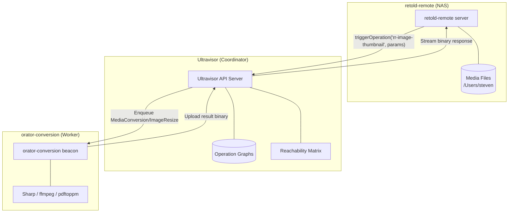
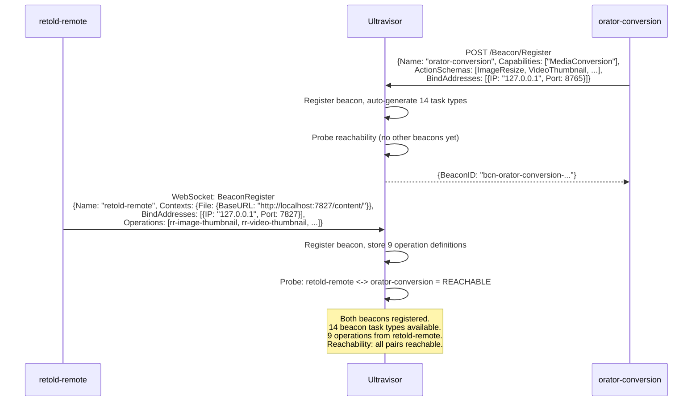
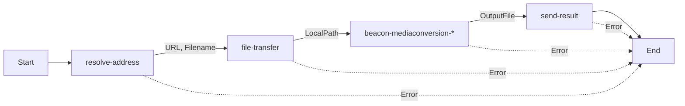
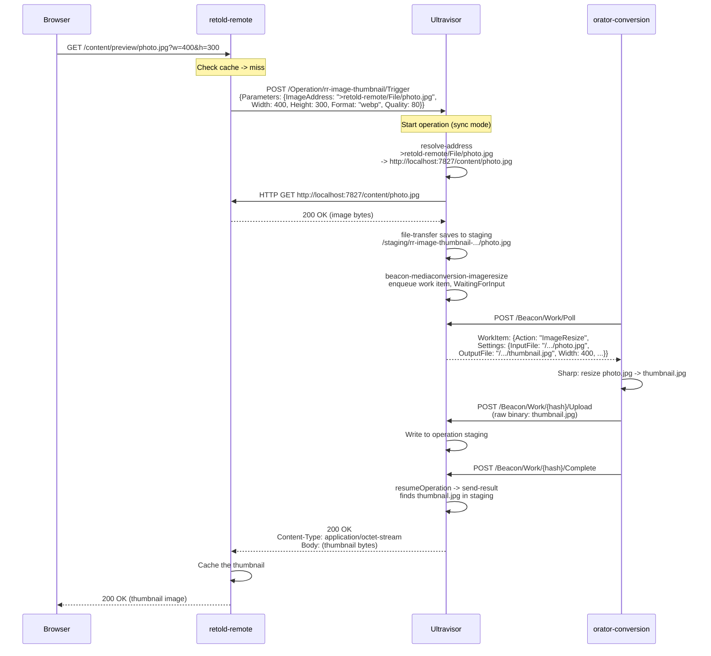
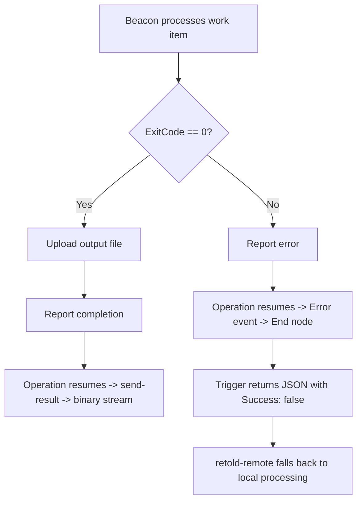

# Case Study: retold-remote + orator-conversion

This case study shows how retold-remote (a media browser) and orator-conversion (a media processing worker) integrate through Ultravisor's operation pipeline to generate thumbnails, previews, waveforms, and other derived media artifacts.

## System Overview



## How It Connects

### 1. Startup

All three services start independently:

```bash
# Terminal 1: Ultravisor
ultravisor start -l

# Terminal 2: retold-remote
retold-remote serve ~/Media -u -l

# Terminal 3: orator-conversion
npm start -- -u -l
```

### 2. Registration



### 3. Auto-Generated Operations

retold-remote registers 9 operation definitions during beacon connection. These are complete operation graphs with nodes, connections, and state wiring -- built programmatically by `_buildPipelineOperation()`:

| Operation | Trigger Parameters | Pipeline |
|-----------|-------------------|----------|
| `rr-image-thumbnail` | ImageAddress, Width, Height, Format, Quality | resolve -> transfer -> resize -> send-result |
| `rr-video-thumbnail` | VideoAddress, Timestamp, Width | resolve -> transfer -> extract frame -> send-result |
| `rr-video-frame-extraction` | VideoAddress, Timestamp, Width | resolve -> transfer -> probe -> extract -> send-result |
| `rr-audio-waveform` | AudioAddress, SampleRate, Samples | resolve -> transfer -> waveform -> send-result |
| `rr-audio-segment` | AudioAddress, Start, Duration, Codec | resolve -> transfer -> extract -> send-result |
| `rr-pdf-page-render` | PdfAddress, Page, LongSidePixels | resolve -> transfer -> render -> send-result |
| `rr-image-convert` | ImageAddress, Format, Quality | resolve -> transfer -> convert -> send-result |
| `rr-ebook-convert` | EbookAddress | resolve -> transfer -> ebook-convert -> send-result |
| `rr-media-probe` | MediaAddress | resolve -> transfer -> ffprobe -> send-result |

Each pipeline follows the same pattern:



State connections wire outputs from earlier nodes into inputs of later nodes:
- `resolve.URL` -> `transfer.SourceURL`
- `resolve.Filename` -> `transfer.Filename`
- `transfer.LocalPath` -> `process.InputFile`

## End-to-End: Image Thumbnail Generation

When a user navigates to a folder in retold-remote, the browser requests thumbnails. Here's the complete flow:



### Timing

On localhost, the full round-trip takes ~1-3 seconds:

| Step | Duration |
|------|----------|
| Address resolution | < 1ms |
| File transfer (50MB image) | ~200ms |
| Sharp resize | ~500ms |
| Binary upload | ~100ms |
| Total | ~1s |

### Fallback

If Ultravisor is unreachable or the operation fails, retold-remote falls through to local processing:

```javascript
this._dispatcher.triggerOperation('rr-image-thumbnail',
    { ImageAddress: '>retold-remote/File/' + tmpRelPath, Width, Height, Format, Quality },
    (pTriggerError, pResult) =>
    {
        if (!pTriggerError && pResult && pResult.OutputBuffer)
        {
            return fCallback(null, pResult.OutputBuffer);
        }
        // Fall through to local Sharp/ImageMagick
        this._generateImageThumbnailLocal(pFullPath, pWidth, pHeight, pFormat, fCallback);
    });
```

## Large File Support

orator-conversion handles arbitrarily large images (including 256MB+ scans):

- **File-path mode**: Sharp receives the file path directly instead of loading the entire file into a buffer
- **No pixel limit**: `sharp(filePath, { limitInputPixels: false })` -- disables Sharp's default pixel limit
- **Streaming**: File transfer uses Node.js streams, avoiding full-file buffering
- **Binary upload**: Result files transfer as raw bytes over HTTP or WebSocket -- no base64 encoding

## Error Handling

When a beacon reports a non-zero exit code (e.g., Sharp can't process a corrupt file), the beacon client reports it as an error. The operation graph's Error event fires, routing to the End node. The trigger returns a JSON response with `Success: false`, and retold-remote falls back to local processing.



## Logging

All three services support `-l` for file logging:

```bash
ultravisor start -l                    # ultravisor-2026-03-21T...log
retold-remote serve ~/Media -u -l      # retold-remote-2026-03-21T...log
npm start -- -u -l                     # orator-conversion-2026-03-21T...log
```

Key log prefixes for tracing the pipeline:
- `[TriggerOp]` -- retold-remote dispatcher
- `[Trigger]` -- Ultravisor trigger endpoint
- `[Engine]` -- Ultravisor execution engine
- `[Coordinator]` -- Beacon coordinator (work queue, uploads)
- `[OratorConversion]` -- orator-conversion provider
- `[Beacon]` -- Beacon client (execution, upload, completion)
