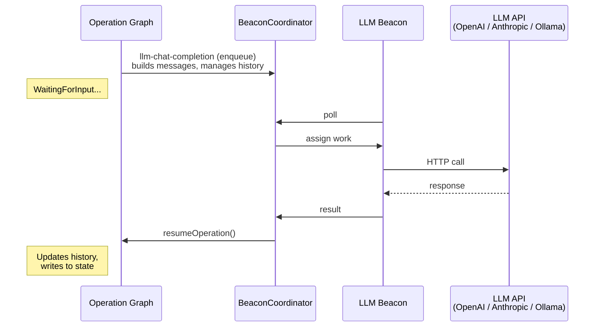

# LLM Integration

Ultravisor can send requests to large language models (LLMs) through the
Beacon system. An LLM Beacon wraps an API — OpenAI, Anthropic, a local
Ollama instance, or any OpenAI-compatible endpoint — and exposes it as a
capability that operation graphs can use like any other task.

This means you can build workflows that read data, send it to an LLM for
analysis or generation, and act on the response, all within the standard
Ultravisor operation graph.

## How It Works

The LLM functionality has two layers:

1. **Beacon Provider** (`LLM`) — runs on the Beacon worker, wraps the
   actual HTTP calls to the LLM API. This is the "thin wrapper" that
   handles authentication, request formatting, and response normalization
   across different backends.

2. **Graph Task Types** (`llm-chat-completion`, `llm-embedding`,
   `llm-tool-use`) — run on the Ultravisor server, dispatch work to an
   LLM Beacon, manage conversation history, and route results back into
   the operation state.



## Supported Backends

| Backend            | Config value         | Description                                |
|--------------------|----------------------|--------------------------------------------|
| OpenAI             | `openai`             | GPT-4, GPT-4o, o1, etc.                   |
| Anthropic          | `anthropic`          | Claude Opus, Sonnet, Haiku                 |
| Ollama             | `ollama`             | Local models (Llama 3, Mistral, Phi, etc.) |
| OpenAI-compatible  | `openai-compatible`  | Any API that follows the OpenAI format     |

The provider normalizes differences between backends automatically. For
example, Anthropic uses `x-api-key` headers and a different message
format; Ollama puts parameters in an `options` object. You don't need to
worry about these details — just set the `Backend` config value and
provide your messages.

## Actions

### ChatCompletion

Send messages to an LLM and receive a text completion.

**Settings:**

| Name            | Required | Description                                      |
|-----------------|----------|--------------------------------------------------|
| Messages        | No       | JSON array of `{role, content}` message objects   |
| SystemPrompt    | No       | System prompt (prepended automatically)           |
| Model           | No       | Override the default model                        |
| Temperature     | No       | Sampling temperature (0-2, lower = more focused)  |
| MaxTokens       | No       | Maximum tokens to generate                        |
| TopP            | No       | Nucleus sampling parameter                        |
| StopSequences   | No       | JSON array of stop sequences                      |
| ResponseFormat  | No       | `"text"` or `"json_object"`                       |

**Outputs:**

| Name             | Description                          |
|------------------|--------------------------------------|
| Content          | The generated text                   |
| Model            | Model that produced the response     |
| FinishReason     | Why generation stopped (`stop`, `length`, etc.) |
| PromptTokens     | Token count for the input            |
| CompletionTokens | Token count for the output           |
| TotalTokens      | Combined token count                 |
| Result           | Same as Content (convention)         |

### Embedding

Generate vector embeddings for text.

**Settings:**

| Name  | Required | Description                       |
|-------|----------|-----------------------------------|
| Text  | Yes      | Text to embed                     |
| Model | No       | Override the default model         |

**Outputs:**

| Name       | Description                              |
|------------|------------------------------------------|
| Embedding  | JSON array of floating point numbers     |
| Dimensions | Number of dimensions in the embedding    |
| Model      | Model used                               |

### ToolUse

Chat completion with tool/function definitions. The LLM can request tool
calls, which are returned as structured data.

**Settings:**

| Name       | Required | Description                                |
|------------|----------|--------------------------------------------|
| Messages   | Yes      | JSON array of message objects              |
| Tools      | Yes      | JSON array of tool definitions             |
| Model      | No       | Override model name                        |
| ToolChoice | No       | `"auto"`, `"none"`, or a specific tool name |
| Temperature| No       | Sampling temperature                       |
| MaxTokens  | No       | Maximum tokens to generate                 |

**Outputs:**

| Name             | Description                                |
|------------------|--------------------------------------------|
| Content          | Text response (may be empty if tool call)  |
| ToolCalls        | JSON array of tool call objects            |
| FinishReason     | `stop`, `tool_calls`, etc.                 |
| PromptTokens     | Token count for the input                  |
| CompletionTokens | Token count for the output                 |

Tool call objects are normalized to the OpenAI format regardless of
backend:

```json
{
  "id": "call_abc123",
  "type": "function",
  "function": {
    "name": "get_weather",
    "arguments": "{\"city\": \"Portland\"}"
  }
}
```

## Graph Task Types

The server-side task types wrap `beacon-dispatch` with LLM-specific
conveniences: message building, conversation history, and state I/O.

### llm-chat-completion

The primary task for using LLMs in operation graphs.

**Convenience settings** (in addition to all ChatCompletion settings):

| Name               | Description                                              |
|--------------------|----------------------------------------------------------|
| UserPrompt         | User message text (builds Messages for you)              |
| InputAddress       | State address to read context data from — appended to UserPrompt |
| Destination        | State address to write the completion content to         |
| AffinityKey        | Route to a specific Beacon                               |
| TimeoutMs          | Override timeout (default: 120000)                       |

**Example node data:**

```json
{
  "SystemPrompt": "You are a code review assistant.",
  "UserPrompt": "Review this code for bugs:",
  "InputAddress": "TaskOutput.read-file-node.Content",
  "Destination": "Operation.ReviewResult",
  "Temperature": 0.3,
  "MaxTokens": 2048
}
```

### Conversation Management

Multi-turn conversations are supported through shared message history
stored in operation or global state.

| Setting                    | Description                                            |
|----------------------------|--------------------------------------------------------|
| ConversationAddress        | State address for the message history array            |
| AppendToConversation       | Append this exchange to history (default: true)        |
| ConversationMaxMessages    | Sliding window — keep only the N most recent messages  |
| ConversationMaxTokens      | Token budget — trim oldest messages when exceeded      |
| PersistConversation        | Copy history to GlobalState on completion              |
| ConversationPersistAddress | GlobalState address for cross-operation persistence    |

**How it works:**

When `ConversationAddress` is set, the task:

1. Reads existing message history from that state address
2. Prepends `SystemPrompt` if not already present
3. Appends the new `UserPrompt` as a user message
4. Applies sliding window limits (max messages, max tokens)
5. Sends the full history to the LLM
6. Appends the assistant response to the history
7. Writes updated history back to the state address

**Within a single operation** — use `Operation.` addresses:

```
llm-node-1 (ConversationAddress: "Operation.Chat")
    → llm-node-2 (ConversationAddress: "Operation.Chat")
    → llm-node-3 (ConversationAddress: "Operation.Chat")
```

Each node sees the full conversation so far and adds to it.

**Across operations** — use `Global.` addresses:

Set `ConversationAddress: "Global.Sessions.MyAgent"` to store history in
GlobalState, which persists across operation runs.

Or use `PersistConversation: true` with
`ConversationPersistAddress: "Global.Sessions.MyAgent"` to work in
OperationState during the run and copy to GlobalState when done.

### llm-embedding

Dispatches an embedding request. Supports `InputAddress` to read text
from state and `Destination` to write the embedding.

### llm-tool-use

Like `llm-chat-completion` but includes tool definitions. Supports
conversation management. Returns both `Content` and `ToolCalls`.

## Routing

All LLM Beacons advertise `Capability: "LLM"`. When an `llm-chat-completion`
task runs, the coordinator assigns the work to any available LLM Beacon.

To target a specific Beacon (e.g., the one running Claude vs. the one
running Llama), use `AffinityKey`:

```json
{
  "UserPrompt": "Explain quantum computing",
  "AffinityKey": "claude-worker"
}
```

The first request with that affinity key binds to whichever Beacon picks
it up. Subsequent requests with the same key go to the same Beacon.

## Example Operations

Two example operations are included in `operation-library/`:

- **llm-summarize.json** — Reads a file, sends it to an LLM for
  summarization, writes the result. Demonstrates single-turn usage with
  `InputAddress` and `Destination`.

- **llm-multi-turn-analysis.json** — Three chained LLM calls sharing
  a `ConversationAddress`: initial analysis, follow-up question, and
  final synthesis. Demonstrates multi-turn conversation with persistence
  to GlobalState.
