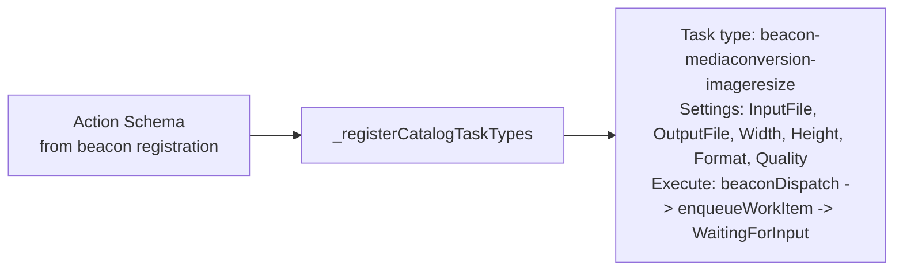
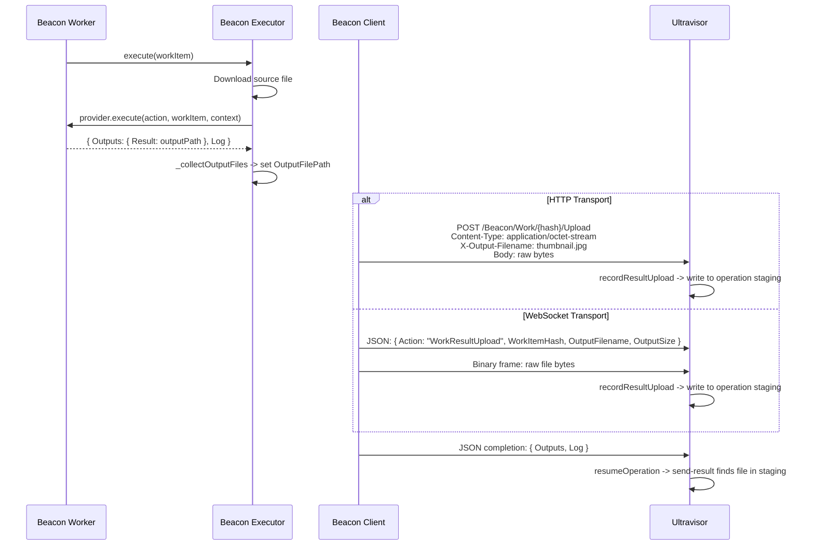

# Platform Cards & Task Types

Ultravisor's operation graphs are built from cards (task types). Platform cards handle the infrastructure layer -- address resolution, file transfer, and result delivery. Extension cards handle beacon dispatch. Beacon cards are auto-generated from registered beacon capabilities.

## Platform Cards

### resolve-address

Resolves a universal address (`>beacon/context/path`) to a concrete URL with optional transfer strategy selection.

See [Universal Addressing](universal-addressing.md) for full details.

### file-transfer

Downloads a file from a URL to the operation's staging directory.

| Setting | Type | Required | Description |
|---------|------|----------|-------------|
| `SourceURL` | String | Yes | URL to download from |
| `Filename` | String | Yes | Filename to save as in staging |

| Output | Type | Description |
|--------|------|-------------|
| `LocalPath` | String | Absolute path to the downloaded file |
| `BytesTransferred` | Number | File size in bytes |
| `DurationMs` | Number | Download duration |

Supports HTTP/HTTPS with single-redirect following. 5-minute timeout. Creates staging directory if needed.

### send-result

Marks a staging file as the operation's binary output. The trigger endpoint streams this file directly to the caller.

| Setting | Type | Required | Description |
|---------|------|----------|-------------|
| `FilePath` | String | Yes | Path to the result file (relative to staging) |
| `OutputKey` | String | No | Key name for the output (default: `ResultFile`) |

| Output | Type | Description |
|--------|------|-------------|
| `StagingFilePath` | String | Absolute path to the result file |
| `BytesSent` | Number | File size in bytes |
| `DurationMs` | Number | Processing duration |

The trigger endpoint scans all task outputs for `StagingFilePath`. If found and the file exists, it streams the file as `application/octet-stream` with metadata in response headers (`X-Run-Hash`, `X-Status`, `X-Elapsed-Ms`).

### base64-encode / base64-decode

Encode a staging file to a base64 string or decode a base64 string to a staging file. Used for embedding small binary payloads in operation state.

## Extension Cards

### beacon-dispatch

The generic card for dispatching work to beacon workers. Most users won't use this directly -- catalog-generated beacon cards provide typed wrappers.

| Setting | Type | Required | Description |
|---------|------|----------|-------------|
| `RemoteCapability` | String | Yes | Required capability (e.g., `Shell`, `MediaConversion`) |
| `RemoteAction` | String | No | Specific action within the capability |
| `Command` | String | No | Shell command for Shell capability |
| `InputData` | String | No | JSON data with universal addresses (auto-resolved) |
| `OutputFile` | String | No | Expected output filename (triggers binary upload) |
| `AffinityKey` | String | No | Sticky routing key |
| `TimeoutMs` | Number | No | Work item timeout (default: 300000) |

When `OutputFile` is set, the executor:
1. Sets up a work directory for the output
2. After processing, collects the output file
3. Uploads it to Ultravisor's staging directory via HTTP POST or WebSocket binary frame
4. Reports JSON completion separately

## Auto-Generated Beacon Cards

When a beacon registers with action schemas, Ultravisor auto-generates typed task cards. For example, orator-conversion's `MediaConversion` capability with `ImageResize` action becomes:

**`beacon-mediaconversion-imageresize`**

The naming convention is: `beacon-{capability}-{action}` (lowercased, non-alphanumeric replaced with hyphens).

### How Auto-Generation Works

1. Beacon registers with `ActionSchemas` array containing capability, action name, settings schema, and description
2. Coordinator's `_updateActionCatalog()` stores them persistently
3. `_registerCatalogTaskTypes()` iterates the catalog and creates a task type config for each entry
4. Each config gets an `Execute` function via `_createBeaconDispatchExecutor()` that:
   - Coerces setting types (template-resolved strings -> numbers/booleans per schema)
   - Calls `beaconDispatch()` helper to enqueue the work item
   - Returns `WaitingForInput` with `ResumeEventName: 'Complete'`
5. Built-in task types take precedence -- catalog types are only registered if no type with the same hash exists

### Current orator-conversion Actions

| Hash | Action | Settings |
|------|--------|----------|
| `beacon-mediaconversion-imagejpgtopng` | ImageJpgToPng | InputFile, OutputFile |
| `beacon-mediaconversion-imagepngtojpg` | ImagePngToJpg | InputFile, OutputFile |
| `beacon-mediaconversion-imageresize` | ImageResize | InputFile, OutputFile, Width, Height, Format, Quality |
| `beacon-mediaconversion-imagerotate` | ImageRotate | InputFile, OutputFile, Angle |
| `beacon-mediaconversion-imageconvert` | ImageConvert | InputFile, OutputFile, Format, Quality |
| `beacon-mediaconversion-pdfpagetopng` | PdfPageToPng | InputFile, OutputFile, Page |
| `beacon-mediaconversion-pdfpagetojpg` | PdfPageToJpg | InputFile, OutputFile, Page |
| `beacon-mediaconversion-pdfpagetopngsized` | PdfPageToPngSized | InputFile, OutputFile, Page, LongSidePixels |
| `beacon-mediaconversion-pdfpagetojpgsized` | PdfPageToJpgSized | InputFile, OutputFile, Page, LongSidePixels |
| `beacon-mediaconversion-mediaprobe` | MediaProbe | InputFile |
| `beacon-mediaconversion-videoextractframe` | VideoExtractFrame | InputFile, OutputFile, Timestamp, Width |
| `beacon-mediaconversion-videothumbnail` | VideoThumbnail | InputFile, OutputFile, Timestamp, Width |
| `beacon-mediaconversion-audioextractsegment` | AudioExtractSegment | InputFile, OutputFile, Start, Duration, Codec |
| `beacon-mediaconversion-audiowaveform` | AudioWaveform | InputFile, SampleRate, Samples |

## Binary Output Return

When a beacon processes a work item that produces a file output, the result is transferred back to Ultravisor's staging directory as raw binary -- no base64 encoding.

