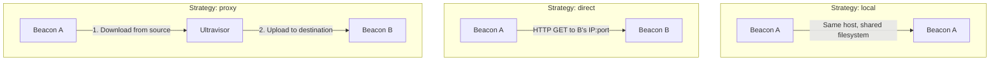
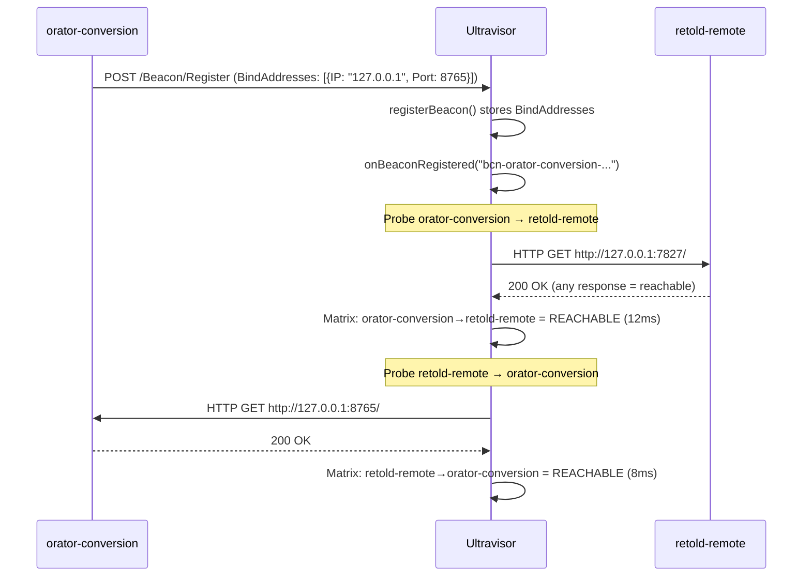
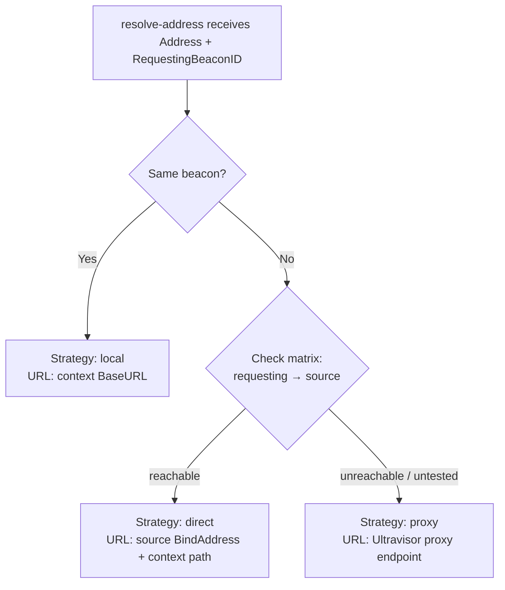

# Beacon Reachability Matrix

The reachability matrix tracks connectivity between beacon pairs in the mesh. It determines whether beacons can communicate directly or need to route through Ultravisor as a proxy.

## Why It Exists

In a distributed deployment, beacons may be on different networks:

- A retold-remote server on a home NAS (192.168.1.50)
- An orator-conversion worker on a cloud VM (10.0.0.5)
- Ultravisor on a VPS with public IP

The NAS can't reach the cloud VM directly, and vice versa. But both can reach Ultravisor. The reachability matrix discovers this topology and the resolve-address card uses it to choose the right transfer strategy.

## Transfer Strategies



| Strategy | When Used | Hops | Latency |
|----------|-----------|------|---------|
| `local` | Source and destination are the same beacon | 0 | Filesystem I/O only |
| `direct` | Reachability probe succeeded between the pair | 1 | Single HTTP transfer |
| `proxy` | Beacons can't reach each other, or connectivity untested | 2 | Two transfers via Ultravisor |

## How Probing Works

When a beacon registers (or reconnects), the `UltravisorBeaconReachability` service probes connectivity between the new beacon and all existing online beacons.



### Probe Details

- **Method**: HTTP GET to the beacon's first BindAddress (`{Protocol}://{IP}:{Port}/`)
- **Success criteria**: Any HTTP response (even 404) counts as reachable — we're testing network connectivity, not service correctness
- **Timeout**: 5 seconds per probe
- **Cache TTL**: 15 minutes — entries older than this are re-probed on next use
- **Trigger**: Probes fire on beacon registration and can be triggered manually via the API

### BindAddresses

Beacons report their network addresses during registration:

```javascript
BindAddresses: [
    { IP: '192.168.1.50', Port: 7827, Protocol: 'http' }
]
```

These are IP addresses, not DNS hostnames — this avoids NAT/split-horizon DNS complications. The reachability service uses the first BindAddress to construct probe URLs.

## Matrix Storage

The matrix is stored in-memory on the `UltravisorBeaconReachability` service as a map keyed by directional pairs:

```
Key: "bcn-retold-remote-123::bcn-orator-conversion-456"
Value: {
    SourceBeaconID: "bcn-retold-remote-123",
    TargetBeaconID: "bcn-orator-conversion-456",
    Status: "reachable",        // reachable | unreachable | untested
    ProbeLatencyMs: 12,
    LastProbeAt: "2026-03-21T18:00:00.000Z",
    ProbeURL: "http://127.0.0.1:8765/"
}
```

Probing is **directional** — A reaching B doesn't guarantee B can reach A (asymmetric firewalls, NAT).

## How resolve-address Uses the Matrix

When the resolve-address card receives a `RequestingBeaconID`, it consults the reachability service:



For `direct` strategy, the resolve-address card builds a URL from the source beacon's BindAddress combined with the context's path:

```
DirectURL = http://192.168.1.50:7827/content/Pictures/photo.jpg
```

For `proxy` strategy, the URL falls back to the context's BaseURL (routed through Ultravisor):

```
ProxyURL = http://localhost:7827/content/Pictures/photo.jpg
```

## API Endpoints

| Method | Path | Description |
|--------|------|-------------|
| `GET` | `/Beacon/Reachability` | Returns the full matrix as an array |
| `POST` | `/Beacon/Reachability/Probe` | Triggers probeAllPairs(), returns updated matrix |

## Web UI: Reachability Map

The Beacons screen includes a visual reachability map (SVG) showing:

- Beacons as labeled circles arranged in a ring
- Ultravisor as a center hub
- Lines between beacon pairs, color-coded:
  - **Green solid** — Direct connectivity confirmed
  - **Red dashed** — Unreachable
  - **Grey dotted** — Untested
- Hover tooltip with latency and last probe time
- "Probe All" button to trigger a fresh probe sweep
